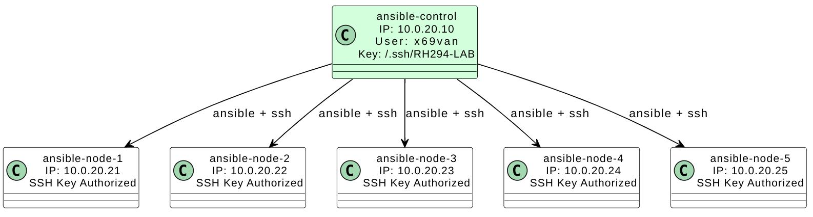

# RHCE 9 (EX294) Practice Lab

This repository provides a complete simulation environment to practice for the **RHCE 9 (EX294)** exam, including:

- 🔸 18 practice tasks with real-world relevance
- 🔸 A pre-configured `.raw` image for control node deployment
- 🔸 Scripts and instructions for cloning additional managed nodes
- 🔸 Compatible with KVM/libvirt and convertible to other formats

> This repository is based on [this video tutorial](https://www.youtube.com/watch?v=iCWa4Me0ykM&t=8262s)

---

## Project Structure

```
rhce9-ex294-practice-lab/
├── images
│   ├── topology.jpg
│   └── vim-ansible-doc.gif
├── README.md
├── solutions
│   ├── answer-01.md
│   ├── answer-02.md
│   ├── answer-03.md
│   ├── answer-04.md
│   ├── answer-05.md
│   ├── answer-06.md
│   ├── answer-07.md
│   ├── answer-08.md
│   ├── answer-09.md
│   ├── answer-10.md
│   ├── answer-11.md
│   ├── answer-12.md
│   ├── answer-13.md
│   ├── answer-14.md
│   ├── answer-15.md
│   ├── answer-16.md
│   ├── answer-17.md
│   └── answer-18.md
└── tasks
    ├── task-01.txt
    ├── task-02.txt
    ├── task-03.txt
    ├── task-04.txt
    ├── task-05.txt
    ├── task-06.txt
    ├── task-07.txt
    ├── task-08.txt
    ├── task-09.txt
    ├── task-10.txt
    ├── task-11.txt
    ├── task-12.txt
    ├── task-13.txt
    ├── task-14.txt
    ├── task-15.txt
    ├── task-16.txt
    ├── task-17.txt
    └── task-18.txt

4 directories, 39 files
```

---

## Network Topology

> IPs and hostnames shown below are examples. You must assign appropriate values based on your setup.



This topology assumes:

- One control node: `ansible-control`
- Five managed nodes: `ansible-node-[1-5]`
- All nodes have user `x69van` with SSH access pre-configured

---

## Disk Images Available

We provide pre-converted images in 3 formats, ready to use:

| File               | Format | Compressed Size | Uncompressed Size |
|--------------------|--------|------------------|--------------------|
| `control.raw.xz`   | RAW    | ~2.0 GB          | 10.0 GB            |
| `control.qcow2.xz` | QCOW2  | ~2.0 GB          | 3.0 GB             |
| `control.vmdk.xz`  | VMDK   | ~2.0 GB          | 3.0 GB             |

**SHA-256 checksums** are provided for each compressed file in the Release section.

This practice lab is based on a single control node (ansible-control) that manages several cloned nodes (ansible-node-1 to ansible-node-5) using SSH and Ansible.

You will first deploy the control node from the provided base image, and then clone this VM to create the managed nodes. Each clone will later be uniquely reconfigured using the built-in /usr/bin/ansible-reconfig.sh script included in the image.

> Use **SCSI** or **Virtio** for best disk compatibility. **Do not use NVMe** in VMware — it will not boot properly.

---

## Getting Started

1. **Download** one of the available disk images from the [Releases](../../releases) section.
2. **Decompress** it using:

```bash
xz -d control.qcow2.xz     # or .vmdk.xz / .raw.xz
```

Create a VM using the decompressed image as the primary disk.
Clone that VM to create 5 managed nodes.

> Run the configuration script on each clone (see below).

---

## Recommended VM specs for each node:

RAM: 1 GB
CPU: 1 vCPU
Disk: Attach the converted base image as the primary disk

*(For Task 17)*: Add a second virtual disk of 1 GB to one of the VMs. This additional disk will typically appear as /dev/sdb.

---

## ansible-reconfig.sh: Post-Clone Configuration Script

A built-in script located at:

`/usr/bin/ansible-reconfig.sh`

### Purpose

This script is automatically included in the pre-built `.raw` control node image. After cloning the image to create new lab nodes (e.g., `node1`, `node2`...), this script helps configure each new VM with a unique IP, hostname, and SSH identity.

### How to Use

1. Boot the cloned VM for the first time.
2. Log in as `x69van` with password `1234`.
3. Run:

```bash
sudo /usr/bin/ansible-reconfig.sh
```

You'll be prompted for:

- New IP
- Gateway
- DNS
- Hostname
- Domain

The script will:

- Set hostname with `hostnamectl`
- Replace `/etc/hosts`
- Detect the active NIC with `nmcli`
- Configure static IP/Gateway/DNS
- Restart the network
- Regenerate SSH host keys
- Optionally reboot

> This script should be run on each cloned node once, after cloning.

---

## Ansible Configuration

Example `ansible.cfg` (control node):

```ini
[defaults]
remote_user = x69van
host_key_checking = False
private_key_file = ~/.ssh/RH294-LAB
```

Sample `/etc/hosts` (control node):

```
10.0.20.21 ansible-node-1 ansible-node-1.lab.example.loc
10.0.20.22 ansible-node-2 ansible-node-2.lab.example.loc
10.0.20.23 ansible-node-3 ansible-node-3.lab.example.loc
10.0.20.24 ansible-node-4 ansible-node-4.lab.example.loc
10.0.20.25 ansible-node-5 ansible-node-5.lab.example.loc
```

---

## Validation

After cloning and configuring the VMs and Ansible, test the connection to start the lab tasks.

```bash
[x69van@ansible-control test]$ ansible all -m ping
node1 | SUCCESS => {
    "ansible_facts": {
        "discovered_interpreter_python": "/usr/bin/python3"
    },
    "changed": false,
    "ping": "pong"
}
node5 | SUCCESS => {
    "ansible_facts": {
        "discovered_interpreter_python": "/usr/bin/python3"
    },
    "changed": false,
    "ping": "pong"
}
node4 | SUCCESS => {
    "ansible_facts": {
        "discovered_interpreter_python": "/usr/bin/python3"
    },
    "changed": false,
    "ping": "pong"
}
node2 | SUCCESS => {
    "ansible_facts": {
        "discovered_interpreter_python": "/usr/bin/python3"
    },
    "changed": false,
    "ping": "pong"
}
node3 | SUCCESS => {
    "ansible_facts": {
        "discovered_interpreter_python": "/usr/bin/python3"
    },
    "changed": false,
    "ping": "pong"
}
```

---

## Snapshot Recommendation
After running ansible-reconfig.sh and verifying SSH/Ansible connectivity for each node, it's strongly recommended to:

> Take a snapshot of each VM

This lets you quickly revert to a clean baseline before re-attempting tasks or resetting the lab.

---

## Optional: Vim Enhancement for Ansible Workflow
If you're using Vim to write playbooks, you can improve your productivity with the following .vimrc configuration. It sets up sensible editing defaults and includes a helpful shortcut to view Ansible documentation directly in the editor.

Suggested ~/.vimrc

```vim
" Set leader key to space
let mapleader = " "

" Save and quit shortcuts
nmap <leader>w :w<CR>
nmap <leader>wq :wq<CR>
nmap <leader>q :q<CR>
nmap <leader>Q :q!<CR>

" UI improvements
set cuc              " Highlight cursor column
set cul              " Highlight current line
set nu               " Show line numbers
set ai               " Autoindent

" Indentation settings
set et               " Expand tabs to spaces
set sw=2             " Shift width
set ts=2             " Tab stop
set sts=2            " Soft tab stop

" Folding and search
set fdm=indent       " Fold based on indent
set fdl=99           " Start with folds open
set hls              " Highlight search
set ic               " Ignore case
set is               " Incremental search

" Enable syntax highlighting
syntax on

" Show man page for Ansible module under cursor in vertical split
nnoremap <leader>K :set splitright<CR>:vnew<CR>:setlocal buftype=nofile<CR>:r! ansible-doc <C-R><C-W><CR>
```

How `<leader>K` Works
With this mapping, you can:

Place the cursor over the name of an Ansible module (e.g. copy, user, file).

Press `<leader>K` (i.e. `<Space>K`).

Vim opens a vertical split showing the man page of the module directly in a new buffer.

You can then easily copy examples or options from the doc into your current playbook file.

Works best if you have ansible-doc man pages installed (they usually are if Ansible is installed).

### Demo: Quick access to Ansible docs in Vim with `<leader>K`


---

## Final Notes
Once you've successfully booted the control node and reconfigured the cloned VMs, you’re ready to begin practicing.

You can start working directly with the tasks in the tasks/ folder. If you get stuck or want to verify your approach, feel free to consult the solutions/ section for guidance.

> We hope this repository supports your preparation and brings you closer to success in obtaining your RHCE 9 certification. Best of luck!
